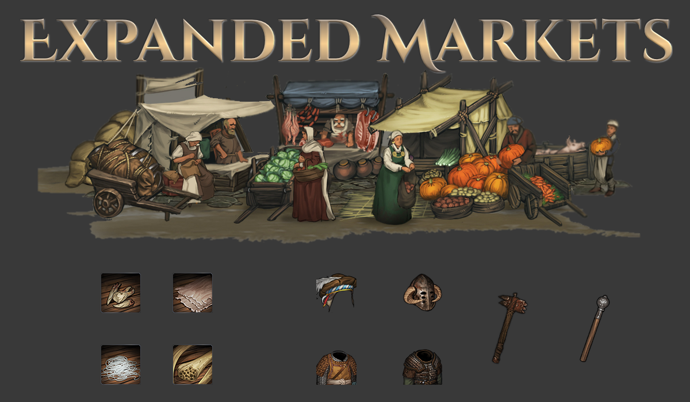

# Sato's Expanded Markets

A mod for the game Battle Brothers ([Steam](https://store.steampowered.com/app/365360/Battle_Brothers/), [GOG](https://www.gog.com/game/battle_brothers), [Developer Site](http://battlebrothersgame.com/buy-battle-brothers/)).

## Table of contents

-   [Features](#features)
-   [Requirements](#requirements)
-   [Installation](#installation)
-   [Uninstallation](#uninstallation)
-   [Compatibility](#compatibility)
-   [Building](#building)

## Features

Expanded Markets increases the selection of goods available to purchase in settlements. Specifically:

**Faction gear:** Duelist Hats can now be purchased in marketplaces, provided the settlement has an attached Leather Tanner or Trapper. Zweihander Helmets, Decorated Full Helms, and Heraldic Hauberks can now be purchased from Armorsmiths, provided the settlement has an attached Blast Furnace. They're all about as rare as named items, so don't be surprised if you don't see any right away. When they do spawn, they will be in the variants specific to the faction of the owning settlement.

**Raider gear:** Barbarian, Brigand, and Nomad specific equipment will now rarely show up for sale in marketplaces. Don't expect to see anything from the super elite enemies (no Barbarian King or Blade Dancer headgear, for instance). Only Northern settlements will have Barbarian gear show up, only City-States will have Nomad gear, etc.

**Beast Components:** Settlements with Taxidermists will now occasionally have beast crafting components available for sale. Trophies from the rarest and most dangerous beasts will have a markup, so be prepared to pay up if you want Lindwurm scales or the heart of a Schrat. Beast parts are region specific, so go North for white Unhold fur, South for Serpent scales, etc.

**Named Shields:** Armorsmiths can now sell Named Shields, everybody's favorite.

## Requirements

1) [Modding Script Hooks](https://www.nexusmods.com/battlebrothers/mods/42) (v20 or later)

## Installation

1) Download the mod from the [releases page](https://github.com/jcsato/sato_expanded_markets_mod/releases/latest)
2) Without extracting, put the `sato_expanded_markets_*.zip` file in your game's data directory
    1) For Steam installations, this is typically: `C:\Program Files (x86)\Steam\steamapps\common\Battle Brothers\data`
    2) For GOG installations, this is typically: `C:\Program Files (x86)\GOG Galaxy\Games\Battle Brothers\data`

## Uninstallation

1) Remove the relevant `sato_expanded_markets_*.zip` file from your game's data directory

## Compatibility

This should be fully save game compatible, i.e. you can make a save with it active and remove it without corrupting that save.

This should be fairly compatible with other mods, except where obvious (e.g. mods that change the same thing).

### Building

To build, run the appropriate `build.bat` script. This will automatically compile and zip up the mod and put it in the `dist/` directory, as well as print out compile errors if there are any. The zip behavior requires Powershell / .NET to work - no reason you couldn't sub in 7-zip or another compression utility if you know how, though.

Note that the build script references the modkit directory, so you'll need to edit it to point to that before you can use it. In general, the modkit doesn't play super nicely with spaces in path names, and I'm anything but a batch expert - if you run into issues, try to run things from a directory that doesn't include spaces in its path.

After building, you can easily install the mod with the appropriate `install.bat` script. This will take any existing versions of the mod already in your data directory, append a timestamp to the filename, and move them to an `old_versions/` directory in the mod folder; then it will take the built `.zip` in `dist/` and move it to the data directory.

Note that the install script references your data directory, so you'll need to edit it to point to that before you can use it.
